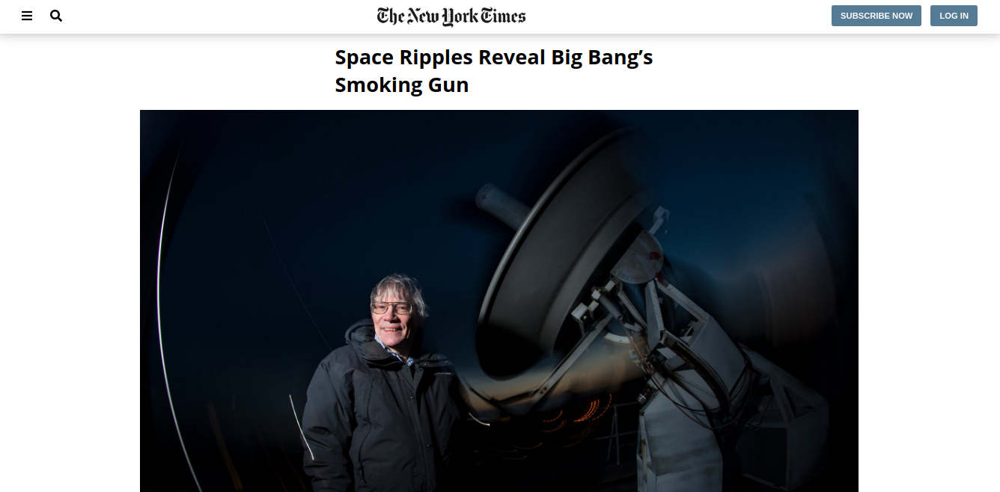

# The New York Times Article Clone

> This is the third project for the Html and Css curriculum of the Microverse full time program. We made a mock-up of an article from The New York Times page.

## Built With

- HTML5,
- CSS3,
- Google Fonts,
- Fontawesome

## Live Demo

[Live Demo Link](https://rawcdn.githack.com/Miguelus373/TNYT-Article/616db7d927d50c7685a1119bb67f8ed1aa1db1d1/index.html)

## Getting Started

To get a local copy up and running follow these simple example steps.

- Go to the main page of the repo.
- Press the "Code" button and get the repo link.
- Clone it using git.

## Authors

👤 **Cecilia Benítez**

- Github: [@Ceci007](https://github.com/Ceci007)

👤 **Miguel Uzcátegui**

- Github: [@miguelus373](https://github.com/miguelus373)

## 🤝 Contributing

Contributions, issues and feature requests are welcome!

Feel free to check the [issues page](https://github.com/Miguelus373/TNYT-Article/issues).

## Show your support

Give a ⭐️ if you like this project!

## 📝 License

This project is [MIT](lic.url) licensed.